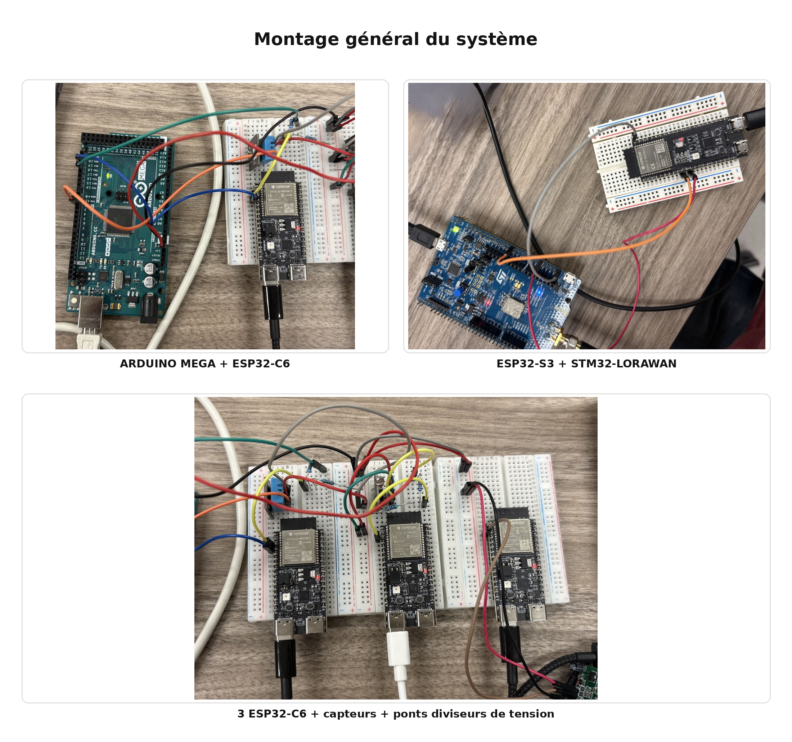

# Présentation du projet

Ce projet vise à simuler une serre connectée (“Greenhouse”) à petite échelle en instrumentant l’environnement avec plusieurs capteurs et en remontant leurs données vers une passerelle. La serre est représentée par trois grandeurs typiques : température/humidité, luminosité et mouvement, afin de reproduire un scénario réaliste de suivi d’ambiance et de détection d’événements.

L’architecture adoptée est une architecture multi-nœuds : chaque capteur est associé à un nœud de collecte (ESP32-C6) qui publie ses mesures vers une passerelle (ESP32-S3). La passerelle centralise les flux provenant de plusieurs nœuds, ce qui permet d’avoir un point unique de réception et de traitement des données.

Enfin, la chaîne est conçue pour aller au-delà du réseau local : la passerelle transmet les données vers un module STM32 LoRaWAN (uplink), qui assure ensuite la remontée vers le cloud (via un réseau LoRaWAN), afin de reproduire un parcours complet “terrain → passerelle → réseau longue portée → cloud”.



---

## Prérequis environnement d'exécution 

- Linux (toute distribution parmi : Debian/Ubuntu, RHEL/CentOS, Fedora, Arch, openSUSE, Alpine, Snap)
- `make` — se bootstrape via `bash scripts/install-make.sh` si absent

---

## Pourquoi Make ?

Ce projet couvre trois domaines distincts :

| Domaine | Langage | Compilation |
|---|---|---|
| Firmware IoT (LoRaWAN) | C / C++ | **Oui** — cross-compilation ESP-IDF, linkage, flash |
| Intégration TTN | C | **Oui** (à venir) |
| Infrastructure cloud | Bash / Docker | Non — orchestration de services |

Le code firmware est du **C compilé** — `make` est donc une dépendance incontournable sur toute machine qui touche au projet.
Ce choix étant déjà imposé, il était naturel d'unifier la surface d'entrée du projet entier sous le même outil plutôt que d'introduire un second task runner (npm scripts, just, taskfile…) pour le cloud.
Make devient ainsi le **point d'entrée unique** : un développeur clone le dépôt, tape `make <cible>` et tout fonctionne, qu'il travaille sur le firmware ou sur l'infrastructure.

---

## Architecture des Makefiles

```
Makefile              ← point d'entrée racine, include les modules
make/
  cloud.mk            ← cibles cloud-*
  lorawan.mk          ← cibles lorawan-* (compilation firmware, à venir)
  ttn.mk              ← cibles ttn-* (intégration TTN, à venir)
```

### Principe de modularisation

Le Makefile racine ne contient aucune recette métier : il délègue à des modules thématiques via `include`.

```makefile
# Makefile
include make/cloud.mk
include make/lorawan.mk
include make/ttn.mk
```

Chaque module est **autonome et préfixé** : toutes les cibles d'un domaine partagent le même préfixe (`cloud-*`, `lorawan-*`, `ttn-*`).
Cela évite les collisions entre domaines et rend la cible appelée auto-documentée (`make cloud-start` vs `make lorawan-flash`).

### Dispatch générique par pattern rule

Chaque module exploite la règle de pattern Make `%` pour éviter de déclarer une cible par script :

```makefile
# make/cloud.mk
cloud-%:
    bash $(CLOUD_SCRIPTS_DIR)/$*.sh
```

`make cloud-start` → `bash scripts/cloud/start.sh`
`make cloud-cert`  → `bash scripts/cloud/cert.sh`
`make cloud-seed`  → `bash scripts/cloud/seed.sh`

Ajouter un nouveau script `scripts/cloud/foo.sh` expose automatiquement `make cloud-foo` sans aucune modification du Makefile.

Les seules **surcharges explicites** sont les cibles sans script 1-pour-1 :

```makefile
cloud-stop:     # docker compose down — pas un script
cloud-daemon:   # start.sh --daemon  — variante avec flag
cloud-restart:  # dépendance cloud-stop + cloud-start
```

### "Accès privé" par l'absence

Les alias courts (`start`, `stop`, `cert`…) ne sont délibérément **pas déclarés** dans le Makefile racine.
`make start` retourne `No rule to make target` — seul `make cloud-start` est accessible.
C'est la façon idiomatique en Make d'encapsuler les détails d'implémentation d'un module.

---

## Cibles disponibles

### Cloud (`make/cloud.mk`)

| Cible | Action |
|---|---|
| `make cloud-start` | Démarre la stack Docker Compose (mode attaché) |
| `make cloud-daemon` | Démarre la stack en arrière-plan (`-d`) |
| `make cloud-stop` | Arrête et supprime les containers |
| `make cloud-restart` | `cloud-stop` puis `cloud-start` |
| `make cloud-cert` | Génère / renouvelle le certificat SSL Let's Encrypt |
| `make cloud-seed` | Peuple l'API avec 15 points de données de test |

### LoRaWAN (`make/lorawan.mk`) — à venir

Compilation du firmware C, flash, monitoring série.

### TTN (`make/ttn.mk`) — à venir

Provisioning The Things Network, enregistrement des devices.

---

## Structure des scripts

```
scripts/
  install-make.sh       ← bootstrap : installe make (source lib/lib.sh)
  lib/
    lib.sh              ← fonctions universelles : detect_pkg_manager,
                           install_package, load_env, require_pkg_manager
  cloud/
    _commons.sh         ← fonctions cloud + bootstrap (source lib.sh,
                           load .env, require_pkg_manager)
    start.sh            ← installe Docker si absent, lance compose
    cert.sh             ← installe certbot si absent, génère le cert SSL
    seed.sh             ← envoie des données de test à l'API webhook
```

### Chaîne de sourcing

```
start.sh / cert.sh
  └── source _commons.sh
        └── source lib/lib.sh
```

Sourcer `_commons.sh` suffit : cela charge `lib.sh`, initialise les variables
(`PROJECT_DIR`, `CLOUD_ENV_FILE`), charge le `.env` et détecte le gestionnaire
de paquets. Aucun script cloud ne répète ces initialisations.

### Support multi-distribution

`lib.sh` supporte nativement : `apt-get`, `yum`, `dnf`, `pacman`, `zypper`, `apk`, `snap`.
La fonction `install_package <paquet>` abstrait l'appel au gestionnaire détecté.
Les fonctions spécifiques cloud (`install_docker`, `install_certbot`, `resolve_compose_cmd`)
n'ont des cas explicites que pour les distributions nécessitant une configuration de dépôt
ou des noms de paquets non-standards ; les autres passent par `install_package`.

---

## Démarrage rapide

```bash
# 1. Cloner et aller à la racine
git clone https://github.com/Imad-tl/IoT-Greenhouse.git
cd IoT-Greenhouse

# 2. Installer make si nécessaire
bash scripts/install-make.sh

# 3. Créer le fichier .env à partir du template
cp cloud/.env.template cloud/.env
# éditer cloud/.env (DOMAIN, mots de passe…)

# 4. Générer le certificat SSL
make cloud-cert

# 5. Démarrer la stack
make cloud-daemon

# 6. (Optionnel) Peupler avec des données de test
make cloud-seed
``` 

# Déploiement — STM32 LoRaWAN Bridge

## Prérequis matériel

- Carte **STM32 B-L072Z-LRWAN1**
- Carte **ESP32-S3**
- Câble USB micro-B (ST-Link, pour flasher et débugger la STM32)
- 3 fils de liaison (UART + GND)
- Accès à un compte **The Things Network (TTN)** avec une gateway LoRaWAN à portée

---

## 1. Câblage physique ESP32 ↔ STM32

Relier les deux cartes avec 3 fils avant de démarrer :

| STM32 | ESP32-S3 |
|-------|----------|
| PA_9 (RX) | TX |
| PA_10 (TX) | RX |
| GND | GND |

> Ne pas croiser GND. Les deux cartes doivent partager la même masse.

---

## 2. Configuration TTN

### 2.1 Créer l'application

1. Se connecter sur [console.thethingsnetwork.org](https://console.thethingsnetwork.org)
2. Aller dans **Applications** → **+ Create application**
3. Renseigner un **Application ID** et valider

### 2.2 Enregistrer le device

1. Dans l'application, aller dans **End devices** → **+ Register end device**
2. Choisir **Enter end device specifics manually**
3. Renseigner :
   - **Frequency plan** : `Europe 863-870 MHz (SF9 for RX2)`
   - **LoRaWAN version** : `LoRaWAN Specification 1.0.2`
4. Générer ou saisir les identifiants :
   - **DevEUI** — identifiant unique de la carte
   - **AppEUI** — peut rester à zéro (`0000000000000000`)
   - **AppKey** — clé de chiffrement, à garder secrète
5. Valider avec **Register end device**

### 2.3 Activer "Resets join nonces"

Pour éviter l'erreur `DevNonce is too small` lors des redémarrages de la carte en développement :

1. Dans les réglages du device → **General settings**
2. **Network layer** → **Advanced MAC settings**
3. Cocher **Resets join nonces** 
4. Sauvegarder

---

## 3. Installation de Keil Studio Cloud

Keil Studio Cloud est un IDE en ligne, aucune installation lourde n'est requise.

1. Se rendre sur [studio.keil.arm.com](https://studio.keil.arm.com)
2. Se connecter avec un compte **Arm** (création gratuite)
3. Dans le menu de gauche, cliquer sur **CMSIS** puis **Import project**
4. Importer le dépôt du projet (URL Git ou archive zip)
5. Une fois importé, sélectionner la cible **DISCO_L072CZ_LRWAN1** dans la barre en haut

### Sur Linux

Le navigateur Chrome ou Edge est recommandé. Le driver ST-Link est nécessaire pour flasher :

```bash
# Ubuntu/Debian
sudo apt install libusb-1.0-0
```

Ajouter une règle udev pour accéder à la carte sans sudo :

```bash
echo 'SUBSYSTEM=="usb", ATTR{idVendor}=="0483", MODE="0666"' | sudo tee /etc/udev/rules.d/99-stlink.rules
sudo udevadm control --reload-rules
```

### Sur Windows

Installer le driver **ST-Link** depuis le site ST si ce n'est pas déjà fait :
[st.com/stm32cubeide](https://www.st.com/en/development-tools/stsw-link009.html)

---

## 4. Configuration des clés dans le projet

Ouvrir le fichier `mbed_app.json` et renseigner les clés récupérées sur TTN à l'étape 2.2 :

```json
"lora.device-eui":      "{ 0xXX, 0xXX, 0xXX, 0xXX, 0xXX, 0xXX, 0xXX, 0xXX }",
"lora.application-eui": "{ 0xXX, 0xXX, 0xXX, 0xXX, 0xXX, 0xXX, 0xXX, 0xXX }",
"lora.application-key": "{ 0xXX, 0xXX, 0xXX, 0xXX, 0xXX, 0xXX, 0xXX, 0xXX, 0xXX, 0xXX, 0xXX, 0xXX, 0xXX, 0xXX, 0xXX, 0xXX }"
```

> Les valeurs sont en **little-endian** : copier le DevEUI affiché sur TTN en inversant l'ordre des octets.

---

## 5. Compilation et flash

1. Dans Keil Studio Cloud, cliquer sur **Build** (icône marteau) pour compiler
2. Une fois la compilation terminée, brancher la STM32 en USB
3. Cliquer sur **Run** pour flasher automatiquement la carte

La carte redémarre automatiquement après le flash.

---

## 6. Vérification du bon fonctionnement

### Port série (debug)

Ouvrir un terminal série sur le port ST-Link à **115200 baud** :

- **Windows** : PuTTY ou Tera Term sur le port COM correspondant
- **Linux** : `minicom -D /dev/ttyACM0 -b 115200` ou `screen /dev/ttyACM0 115200`

La sortie attendue au démarrage :

```
=== STM32 LoRaWAN Bridge ESP32 -> TTN ===
[LORA] Stack initialisée
[LORA] ADR activé, JOIN en cours...
[LORA] Connecté ! En attente de données ESP32...
```

Une fois des données reçues de l'ESP32 :

```
[UART] 23 octets reçus, envoi LoRa...
[LORA] 23 octets planifiés
[LORA] Trame envoyée avec succès
```

### Côté TTN

Les trames doivent apparaître dans **Live data** sur la page du device dans la console TTN, avec le type **Uplink**.

---

## Dépannage

| Symptôme | Cause probable | Solution |
|----------|---------------|----------|
| `JOIN_FAILURE` au démarrage | Clés incorrectes | Vérifier DevEUI, AppEUI, AppKey dans `mbed_app.json` |
| `DevNonce is too small` | Reset de la carte | Activer "Resets join nonces" sur TTN (étape 2.3) |
| Aucune donnée reçue de l'ESP32 | Câblage incorrect | Vérifier PA_9/PA_10 et le GND commun |
| `Duty-cycle : réessai dans 3s` | Limite EU868 atteinte | Normal, la carte réessaie automatiquement |
| Carte non détectée sur Linux | Driver udev manquant | Appliquer la règle udev (étape 3) |
