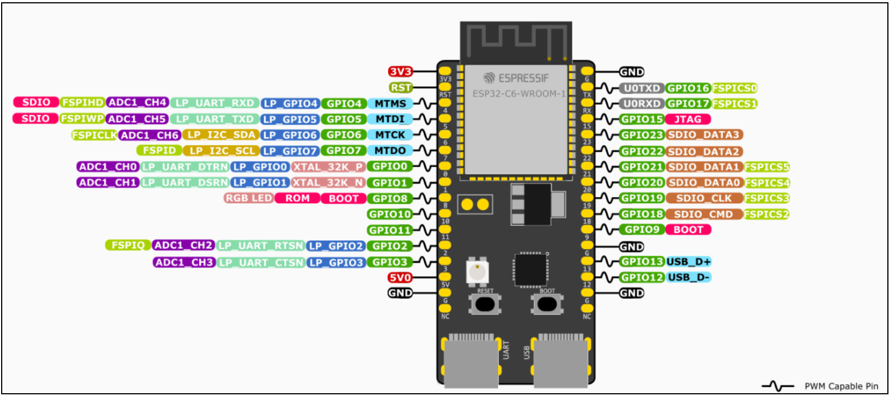

# Télémetrie

Le travail réalisé s’inscrit dans une logique de collecte de mesures issues de capteurs
hétérogènes (capteur de température/humiditéet, capteur de luminosité et capteur de
mouvement) de remontée de ces données vers une passerelle.

Dès le départ, une contrainte matérielle a structuré l’architecture : une partie des capteurs
disponibles fonctionne en 5V, alors que les microcontrôleurs ESP32 (C6/S3) opèrent en 3.3V
sur leurs entrées/sorties. Cette incompatibilité de niveaux logiques rend risqué un câblage direct
capteur-ESP32 sans adaptation.

Le choix a donc été fait de séparer la chaîne en deux domaines : acquisition capteurs 5V d’un
côté, et communication radio / agrégation de l’autre.

À partir de cette contrainte, l’architecture retenue est la suivante :

capteur 5V → Arduino Mega (alimentation + acquisition) → UART → ESP32-C6 (nœud
capteur) → BLE → ESP32-S3 (passerelle).

L’Arduino joue le rôle d’interface d’acquisition, en fournissant l’alimentation 5V et en réalisant
les lectures de capteurs. Les ESP32-C6, eux, sont dédiés à la publication des mesures vers la
passerelle en radio. Cette séparation a été préférée à un montage “tout sur ESP32” car elle
réduit les risques électriques et accélère la mise en route des capteurs.

Une fois la répartition des rôles établie, il fallait choisir un lien fiable entre l’Arduino et chaque
ESP32-C6. L’UART a été retenu parce qu’il s’agit d’un transport point-à-point simple,
déterministe et très facile à diagnostiquer. Concrètement, l’Arduino envoie une trame texte sur
une ligne série et le C6 la réceptionne puis la traite. Ce choix a aussi l’avantage de découpler
complètement l’acquisition et la publication radio : les capteurs peuvent être lus à une cadence
fixe côté Arduino, tandis que l’ESP32-C6 publie lorsque la donnée est valide et disponible.

> → Une difficulté importante est apparue lors des premiers essais : les broches TX/RX
affichées sur certaines cartes ESP32 correspondent souvent à l’UART de console déjà
connecté au port USB (flash + logs). Câbler l’Arduino sur ce même UART provoque des conflits
(données mélangées, upload instable, monitoring impossible).

Pour résoudre cela, l’UART de l’Arduino a été basculé sur UART1 côté ESP32-C6, avec des
broches dédiées GPIO4 (RX) et GPIO5 (TX), de manière à conserver l’USB comme canal de
debug indépendant.



Après le choix du transport UART, la question du format de données s’est posée. Un format
ASCII KEY=VALUE séparé par ; a été adopté, avec un framing basé sur la fin de ligne (\n \r).
Exemple :

```text
T=22.5;H=55, LUM=287;ETAT=SOMBRE, MOTION=1
````

Ce choix est volontairement pragmatique : la lisibilité permet de vérifier rapidement les valeurs
et de diagnostiquer des erreurs de câblage ou de capteur sans outil spécialisé. De plus, le
parsing côté ESP32-C6 reste simple (recherche de sous-chaînes T=, H=, etc., puis conversion).

Ce point a également révélé une limite acceptée à ce stade : l’absence de longueur, de CRC ou
de numéro de séquence signifie que la robustesse n’est pas garantie en cas de corruption de
trame ou de désynchronisation. Pour compenser partiellement, un mécanisme d’acquittement
minimal a été introduit : après parsing, le C6 renvoie ACK\n sur l’UART. Cette décision prépare
l’évolution vers un protocole fiable (ACK/timeout/retransmission), même si, sans SEQ et sans
logique de retry côté Arduino, il s’agit encore d’une validation fonctionnelle plus que d’une QoS
UART complète.

---

## Lien ESP32-C6 vers ESP32-S3 : BLE

Le BLE a été retenu comme technologie de communication entre les nœuds capteurs
(ESP32-C6) et la passerelle (ESP32-S3) pour trois raisons principales. D’abord, c’est la solution
la plus simple à mettre en œuvre rapidement sur ESP32 : elle ne nécessite ni infrastructure (pas
de routeur, pas de configuration IP), ni mise en place d’un réseau complexe, tout en permettant
d’obtenir un lien radio opérationnel et testable immédiatement. Ensuite, BLE est très compatible
avec le fonctionnement recherché dans cette phase : plusieurs nœuds “capteurs” en
périphériques qui publient des données vers une passerelle centralisée qui collecte et agrège.
Enfin, BLE est un protocole sécurisable proprement : il supporte les mécanismes standards
(pairing/bonding, chiffrement des liens, gestion des clés) et peut donc être durci lorsque
l’architecture fonctionnelle est validée.

Dans cette architecture, chaque ESP32-C6 joue le rôle de périphérique BLE (GATT Server) et
l’ESP32-S3 celui de central (GATT Client). Concrètement, chaque C6 annonce sa présence en
advertising sous un nom (ex. GreenHouse-C6-1) et expose un service BLE dédié.
La passerelle S3 scanne l’environnement, détecte les nœuds disponibles, se connecte à eux,
puis récupère les données. Ce modèle correspond exactement à l’usage typique du BLE : des
périphériques embarqués publiant une donnée, et un central responsable de l’agrégation.

### Fonctionnement BLE

Le code du C6 fonctionne parce qu’il est structuré autour de trois mécanismes simples qui se
complètent.

#### 1) Réception UART et reconstruction de trames

Sur le C6 on configure l’UART avec : RX=GPIO4, TX=GPIO5, BAUD=9600. La tâche UART lit
des octets en boucle, reconstruit une ligne jusqu’à \n , puis parse un format texte. Par exemple,
si l’Arduino envoie :

```text
T=22.5;H=55;LUM=287;ETAT=SOMBRE
```

alors le C6 extrait les champs en recherchant les tags (T=, H=, LUM=, ETAT=) et met à jour ses
variables globales (g_temp, g_hum, g_lum, g_etat). Cette approche tient parce qu’elle repose
sur un framing clair (fin de ligne) et un parsing robuste à l’ordre des champs.

#### 2) Publication BLE via un serveur GATT

Le C6 expose un service et une caractéristique qui représente “la dernière donnée capteur”.
Deux comportements sont fournis :

* READ : si la passerelle lit la caractéristique, on_read() renvoie la string formatée.
* NOTIFY : dès qu’une nouvelle mesure arrive (après parsing UART), envoyer_ble() pousse la
  string au central si celui-ci s’est abonné.

Par exemple, la trame peut contenir :

```text
T=22.5;H=55
```

ou

```text
LUM=287;ETAT=SOMBRE
```

ou

```text
MOTION=1
```

Ce fonctionnement est stable parce que la stack NimBLE prend en charge toute la partie
protocolaire (GAP/GATT, subscriptions, encapsulation ATT). Le code applicatif ne fait que définir
les UUID, fournir le callback de lecture, et envoyer une notification quand nécessaire.

#### 3) Logs et acquittement côté UART

Après parsing, un log (ESP_LOGI) affiche les valeurs reçues pour validation. Ensuite, le C6
renvoie ACK\n sur l’UART. Cet ACK confirme que la trame a été reçue et traitée, mais il reste
symbolique tant qu’on n’a pas ajouté côté Arduino un mécanisme complet (timeout,
retransmission, et idéalement numéro de séquence).

---

### → Modèle mental BLE : GAP pour se connecter, GATT pour transporter la donnée

Pour comprendre le BLE proprement, il faut distinguer deux niveaux.

**GAP (connexion) :**
Le C6 diffuse en advertising “je suis
GreenHouse-C6-1 et j’expose un service X”.
La passerelle S3 scanne, voit l’annonce, puis
se connecte. Les callbacks (ex.
gap_event_cb) gèrent connexion,
déconnexion et abonnement aux
notifications.

**GATT (données) :**
Une fois connecté, la donnée est accédée via
une arborescence :
Service (ex. 0x00FF)
Characteristic (ex. 0xFF01) avec READ et
NOTIFY

Brièvement :

* Le S3 lit la characteristic → reçoit T=22.5;H=55 (lecture “snapshot”).
* Le S3 s’abonne → reçoit automatiquement à chaque nouvelle mesure des notifications :
  T=22.6;H=55 puis T=22.6;H=56…

---

### Que se passe-t-il si on a plusieurs ESP32-C6 ?

Avec plusieurs C6 (un par capteur), le S3 (central) scanne et voit plusieurs périphériques
annonçant le même service. Il peut se connecter à chacun, puis s’abonner aux notifications. En
pratique :

On remarque que le fonctionnement reste stable mais plus le nombre de connexions augmente,
plus le coût mémoire/CPU côté central augmente (limite de connexions simultanées). Pour
notre cas, cela ne pose pas problème.

Une conséquence immédiate est l’identification : si tous les nœuds annoncent le même nom et
les mêmes UUID, cela fonctionne, mais la passerelle doit distinguer les sources soit par
l’adresse MAC BLE ou un champ applicatif dans la payload.

Le choix d’un champ applicatif ID a été fait et notre trame a pris la forme suivante :

```text
ID=1;T=22.5;H=55 → Trame envoyée par le capteur 1 de température et humidité
ID=2;LUM=287;ETAT=SOMBRE→ Trame envoyée par le capteur 2 de luminosité
ID=3;MOTION=1→ Trame envoyée par le capteur 3 de mouvements (intrusion)
```

Ce champ ID simplifie fortement l’agrégation et prépare les étapes suivantes (QoS, statistiques,
export cloud).

Un point important est que NOTIFY n’est pas une livraison garantie : c’est best effort. Dans un
contexte chargé (beaucoup de nœuds, radio bruitée), on peut observer : des retards de
notification, des pertes si le central est débordé, des reconnexions.

Si on veut améliorer la fiabilité, deux approches existent :

* utiliser des Indications (confirmées au niveau BLE),
* OU ajouter un SEQ= applicatif pour détecter les pertes et reconstruire des statistiques.

Exemple :

```text
ID=2;SEQ=1042;LUM=287;ETAT=SOMBRE
```

→ Nous avions opté pour cette trame dans notre projet


## La carte ESP32-S3 

